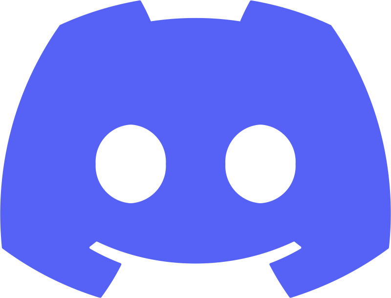

# Hey there, I'm Uday 👋

I build software and real-world products through structured projects, with a strong emphasis on hands-on execution across the development ecosystem.

## 🎯 Current focus
- Systems-level programming and core computer science fundamentals
- Building CLI tools and developer-focused utilities
- Designing clean project structures and maintainable codebases
- Learning through open-source projects and real-world constraints

## 🧩 Projects
### Active / Ongoing
- **[Fluix](https://github.com/udaysh134/fluix)** - An open-core, no-code AI chatbot builder with instant deployment and a clean, intuitive interface.
- **[RepX](https://github.com/udaysh134/repx)** - A universal reputation engine focused on representing trust, contribution, and accountability across diverse domains and systems.
- **[C-Tinker](https://github.com/udaysh134/c-tinker)** - A hands-on C/C++ learning playground, for exploring and experimenting different concepts and practical implementations.
### Inactive / Archived
- **[Xytius](https://github.com/udaysh134/xytius)** - A large-scale, multi-purpose Discord bot focused on automation, moderation, varied features and extensible system design.

## 📷 Activity snapshot

    <table>
        <tr>
            <td align="center">
                 
                
            </td>
            <td align="center">
                 
                
            </td>
        </tr>
    </table>

    
<strong>🧠 Work style</strong>

        <ul>
            <li>I prioritize clarity, structure, and long-term maintainability over quick fixes</li>
            <li>I prefer understanding systems deeply rather than relying on abstractions blindly</li>
            <li>I document decisions and workflows so projects remain understandable over time</li>
        </ul>

    
<strong>🧱 Background</strong>

        <ul>
            <li>Before focusing fully on software development, I worked across many creative fields including music production, visual design and media. That experience continues to influence how I think about structure, discipline, and quality in technical work.</li>
        </ul>

## 🫴 Get in touch
> Join the community or connect with me : 

